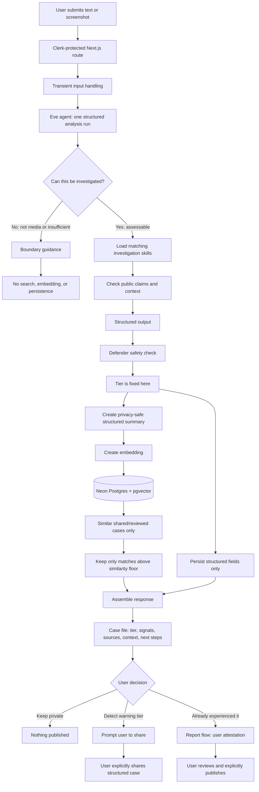

# Media Detective Vietnam: Agent Briefing

This document is a presentation guide for explaining the Media Detective Vietnam agent to a partner, judge, or audience.

The short version:

> Eve does not decide what is true and it does not stop scams or misinformation. It helps a person pause, identify manipulation signals, find useful context, and make a better-informed decision.

## 1. What The Agent Is

Eve is the AI investigation assistant inside Media Detective Vietnam.

It accepts a piece of suspicious content, such as:

- A pasted SMS, Zalo message, Facebook post, email, or advertisement
- Text extracted from a screenshot in the user's browser
- A description of a suspicious call or interaction
- A viral claim or accusation that the user wants to check before sharing

The agent then returns one structured assessment containing:

- Whether the submission is suitable for investigation
- The claims or requests made by the content
- The manipulation techniques it detects
- The content category and likely platform
- A confidence tier: Watch, Caution, or Warning
- A risk score used for internal sorting and aggregation
- A plain-language explanation
- Public evidence sources when useful sources were actually found

The most important output is not a score. It is the explanation that teaches the user what to notice next time.

## 2. What The Agent Is Not

Media Detective is deliberately not presented as a truth machine or an automatic scam police system.

The agent does not:

- Guarantee that a message is true or false
- Prove that a person, image, or video is guilty or innocent
- Stop a scammer from contacting someone
- Remove a post from a social platform
- Replace banks, police, journalists, fact-checkers, or human judgment
- Treat a high similarity match as proof
- Claim 100% accuracy

The product flags signals and teaches verification habits. The human remains responsible for the final decision.

## 3. The Three-Step Pipeline

The MVP has exactly three product steps:

1. **Extract and analyze**: Eve examines the submitted material and fixes the assessment tier.
2. **Find similar cases**: the server searches the structured case library for useful context.
3. **Assemble**: the server combines the analysis and context into a case file for the user.

Similar-case retrieval happens only after Eve has produced the tier. This is important: previous cases can provide context, but they cannot influence the verdict.

## 4. Step 1: Eve's Analysis

### Input boundary first

Before investigating, Eve classifies the submission:

| Status | Meaning | Result |
|---|---|---|
| `assessable` | A message, post, ad, link, screenshot, claim, or firsthand suspicious interaction | Full analysis can run |
| `not_media` | An ordinary request to the assistant, such as coding, translation, or trivia | No investigation or tools |
| `insufficient` | A greeting, gibberish, unusable OCR, or content with no concrete claim or suspicious pattern | Ask for usable content; nothing is saved |

This boundary prevents the agent from treating every user message as a scam. It also prevents unrelated instructions inside user content from becoming instructions for the agent.

### Skills are loaded for the situation

Eve has focused investigation playbooks rather than one giant undirected prompt. The available areas include:

- Checking factual claims
- Checking context around screenshots and media
- Misinformation
- Private-person accusations
- Celebrity or public-figure advertisements
- Timeshare and high-pressure sales scams

The agent uses the relevant playbooks for the submission and then returns one structured result.

### Manipulation taxonomy

The product teaches vocabulary across two connected playbooks.

**Scam signals**

- Urgency
- Fear
- Borrowed authority
- Scarcity
- Fake social proof
- Secrecy or isolation from verification

**Misinformation signals**

- Emotional bait
- Decontextualization
- Fabricated evidence
- Bandwagon or virality-as-proof
- Character attack

The connection is media literacy: both scams and harmful misinformation try to make people trust and act before they verify.

### Public evidence checks

When the submission contains a public, checkable claim, the agent can use guarded tools to look for relevant context:

- Google Fact Check for returned fact-check results
- A restricted Exa search for eligible public-interest fallback cases when enabled
- VirusTotal for a public link already present in the submitted content

Sources are shown only when they are actually returned by the tools. Eve is not allowed to invent citations.

## 5. The Confidence Tiers

The model emits the tier directly. The `risk_score` is only for sorting and aggregate dashboard views.

| Tier | What it means | User guidance |
|---|---|---|
| **Watch** | Nothing flagged yet | Continue the verification habit; this is not a guarantee of safety |
| **Caution** | Some manipulation signals or missing context | Verify before acting, paying, signing, or sharing |
| **Warning** | Strong, converging manipulation signals or a known playbook | Do not send money, sign, share codes, or amplify the content before independent verification |

The phrase “nothing flagged yet” matters. Watch does not mean “safe.”

## 6. Step 2: Similar Cases

After Eve fixes the tier, the server creates a structured summary from the analysis and embeds that summary for vector search.

The search:

- Uses structured summaries, not raw messages or screenshots
- Searches shared cases and reviewed seed cases
- Returns at most three cases
- Enforces a similarity floor of `0.78`
- Can correctly return zero cases

This gives the user context such as: “Others have seen this pattern before.”

It does **not** change the tier. A similar case is context, not evidence and not a verdict.

## 7. Step 3: The Case File

The Next.js server assembles the response into a readable case file containing:

- The tier and its guidance
- The plain-language reasoning
- The claims found in the content
- The manipulation techniques detected
- Category, platform, and money-request details
- Sources checked, when available
- Similar cases, when the similarity floor is met
- A clear privacy explanation

The UI is designed to make the reasoning visible rather than showing an unexplained score.

## 8. Privacy And Safety Boundaries

The privacy model is central to the project:

- Raw pasted content is transient and is never persisted
- Screenshot bytes stay in the browser while local OCR runs
- The database stores structured analysis fields, not the original message or image
- Embeddings are generated from structured summaries only
- Public case files omit raw content, names, phone numbers, and other unnecessary identifiers
- Person-targeting content is handled carefully; private-person identifiers are removed from stored and searchable summaries
- Langfuse observability suppresses prompt, output, and tool-payload content when configured

This lets the project learn from patterns without building a database of people's private messages.

## 9. Detect, Share, And Report

These are different user actions and should be explained separately.

### Detect

The user is unsure and wants help pausing before acting or sharing.

The user submits content privately. If the result reaches the Warning tier, the app prompts them to consider sharing the structured case so another person can recognize the same playbook sooner.

The user can keep the result private.

### Share

Share is an explicit opt-in action for a structured case file.

Only fields such as category, techniques, tier, and explanation are shared. Raw screenshots, original message text, names, numbers, and other sensitive content are not shared.

The user is always able to choose **Keep private**.

### Report

Report is for someone who already knows that an incident happened to them or someone they know.

The same analysis engine structures their account, but publication is based on the user's explicit attestation, not on the AI tier. The UI keeps both signals visible:

- The user says: “This happened to me.”
- The AI says: “These are the manipulation signals I found.”

The user reviews the generated case file before publishing. This is important because an AI model cannot verify someone's lived experience from a form alone.

## 10. Strengths And Pros

### It explains instead of only labeling

The user learns why content feels suspicious: urgency, secrecy, borrowed authority, fabricated evidence, or another recognizable technique.

### It covers scams and misinformation

The same trust-calibration habits apply to a fake money request and a viral accusation. The product treats both as media-literacy problems without pretending they are identical events.

### It keeps the human in control

The user decides whether to act, share, or publish. The AI assists; it does not make an irreversible decision on the user's behalf.

### It is privacy-aware by design

The system is built around structured summaries rather than storing raw personal content.

### It separates verdict from context

The tier is fixed before similar-case retrieval. This reduces the risk that the library simply reinforces a prior label.

### It creates a feedback loop for the community

Opt-in structured reports can help future users recognize recurring patterns without exposing the original private material.

### It is understandable in a short demo

The torch interaction makes the core idea memorable: hold up a light, reveal the signals, then pause and verify.

## 11. Limitations And Cons

### Detection is not prevention

The agent can flag risk signals, but it cannot stop a scammer, freeze a transfer, delete a post, or protect someone who chooses to act anyway.

### A flag is not proof

Warning means strong manipulation or verification risk. It does not automatically prove that every factual detail is false.

Likewise, Watch does not prove that content is safe.

### AI can be wrong or incomplete

The model may miss a subtle scam, misunderstand context, overreact to an unusual but legitimate message, or lack enough evidence. That is why explanations include uncertainty and recommended verification steps.

### Misinformation is difficult to control

False claims can mutate, move across platforms, and target private people before reliable sources catch up. The product can reduce impulsive sharing, but it cannot control the entire information environment.

### Context can be missing

An isolated screenshot may omit the original source, date, sender, or surrounding conversation. The agent can identify the missing verification gap, but it cannot reconstruct evidence that was never provided.

### Similarity is not exact matching

Vector search finds semantically similar patterns. It is not a forensic match for a phone number, bank account, image hash, or identical video. Exact artifact matching is future work.

### Public sources may be unavailable

Fact-check APIs can return no result, be unconfigured, or lag behind a new event. The agent must then be transparent about what it could not verify.

### User reports are still user reports

The Report flow makes a person's account visible as an attestation, not as independently proven fact. Publication should not be described as an AI-confirmed truth claim.

### Privacy limits useful detail

Removing names and identifiers protects people, but it can also make some cases harder to distinguish or verify. The product intentionally chooses harm reduction over building a searchable identity trail.

### It requires a deliberate user action

The tool helps people who pause long enough to use it. It does not automatically inspect every message in Zalo, WhatsApp, Facebook, or email in the MVP.

## 12. Suggested Presentation Walkthrough

Use this sequence for a three-minute explanation:

1. **Start with the human problem.** “A familiar voice, urgent request, or viral accusation can make people act before they verify.”
2. **Show the torch.** “The user holds up a light. The dark posts become readable signals.”
3. **Explain the agent's role.** “Eve does not call something true or false. It extracts claims, names manipulation techniques, and explains what to verify.”
4. **Show the three-step flow.** “Analyze first, retrieve similar context second, assemble the case file third.”
5. **Explain the tier carefully.** “Warning is strong manipulation risk, not a claim of perfect certainty. Watch is not a safety guarantee.”
6. **Show the privacy rule.** “The original screenshot or message is not stored. Only the structured assessment is kept.”
7. **Show Detect versus Report.** “Detect is for uncertainty. Report is for lived experience and requires the user's explicit attestation before publication.”
8. **End with the limitation.** “The agent cannot control scams or misinformation. Its job is to create a pause, teach a verification habit, and let people help one another responsibly.”

## 13. A One-Sentence Answer For Judges

> Media Detective Vietnam uses one structured Eve agent to turn suspicious messages, screenshots, scams, and harmful misinformation into understandable manipulation signals and verification steps, while keeping the human responsible for the final decision and keeping raw personal content private.

## 14. Useful Phrases To Use

- “AI assists, you decide.”
- “A warning is a reason to verify, not a claim of perfect certainty.”
- “Similar cases provide context; they never set the tier.”
- “We do not store the original screenshot or message.”
- “The Report flow separates a user's lived experience from the AI's independent signal.”
- “The goal is not to control the internet. The goal is to help one person pause before the next harmful action.”

## 15. Phrases To Avoid

- “The AI knows whether it is true.”
- “This message is definitely a scam.”
- “The app protects everyone from misinformation.”
- “The model is 100% accurate.”
- “A similar case proves this case.”
- “A user report is automatically verified by AI.”
