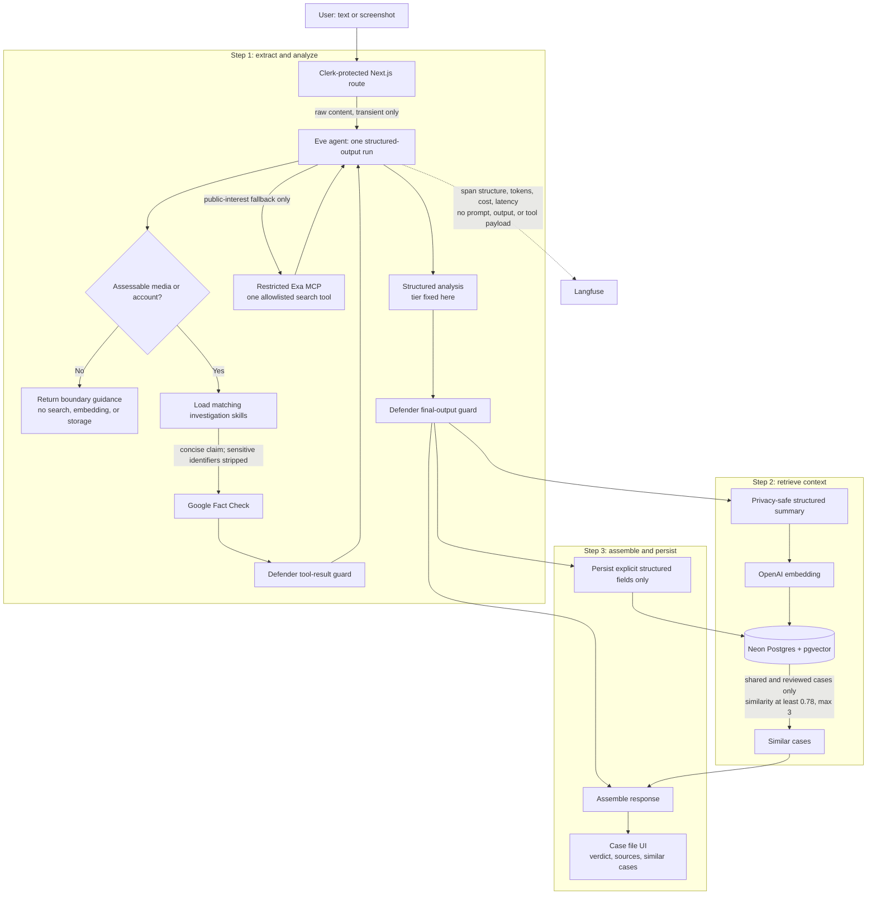

# Media Detective Vietnam

An AI-powered **Media & Information Literacy (MIL)** tool — built for the **UNESCO Youth Hackathon 2026** (track: *AI and MIL*, theme "Play Your Part: Youth Designing the Future of MIL").

Not a scam detector. Not a social feed. A **dashboard-first literacy tool**: the AI investigates suspicious content and *explains its reasoning* — it doesn't replace human judgment, it strengthens it. Users leave every interaction better at spotting the next one themselves.

**Deadline:** August 16, 2026 · **Deliverables:** proposal doc + 3-minute pitch video (English)

## The problem

Three connected patterns are hitting Vietnam right now — isolation + fabricated trust + manufactured urgency:

- **AI deepfake impersonation** *(hero case)* — scammers scrape photos/audio from social media, generate a face-and-voice clone, and run live video calls impersonating relatives to request urgent money. A convincing deepfake call reportedly takes under a minute to produce. Vietnam's National Cyber Security Association names deepfake sophistication the top emerging risk for 2026.
- **Timeshare fraud** *(supporting case)* — Hanoi's Economic Police opened 21 criminal cases, charged 187 people: 493 confirmed victims, ~181 billion VND stolen in that investigation alone. Playbook: prize call → hotel "seminar" → manufactured urgency → sign and pay same-day.
- **Viral misinformation targeting individuals** — fabricated "evidence" and emotional bait turn an unverified accusation into a pile-on before anyone checks the facts. In 2026, a false cheating accusation against a Vietnamese student went viral and the harm proved irreversible. The same trust-calibration skills — check the source, don't share before verifying, virality is not evidence — apply here as much as to financial scams.

Nationally, Vietnam's Ministry of Public Security logged **6,000+ billion VND (~USD 230M+)** in online fraud losses in the first 11 months of 2025. Targets are overwhelmingly older adults, isolated by the shift from multi-generational to nuclear households — and, for misinformation, anyone who can be turned into a viral villain overnight.

## The product — three actions, not a feed

| Action | What it does |
|---|---|
| **Detect** | Paste a message or upload a screenshot. The AI returns a confidence tier, the manipulation techniques found, and a plain-language explanation. Private by default. At the top tier, the app *actively prompts* the user to share. |
| **Share** | Publishes only when the AI's top tier **and** the user's explicit opt-in agree. Only the structured summary publishes — never raw screenshots or message text. |
| **Report** | For people who *already know* — a scam, or a viral lie that targeted them. Same analysis engine, but publishes on the user's attestation; the AI's independent tier is shown as a transparency badge. Requires sign-in (anonymous auth) so submissions are accountable, not anonymous on the backend. |

Detect, Share, Report, and the dashboard require Clerk sign-in. The public home page explains the product and provides the sign-in entry point.

### Confidence tiers

Borrowing vocabulary Vietnamese police warnings already use — even the bottom tier never implies "safe," only "nothing flagged yet."

| Tier | Meaning | Internal score |
|---|---|---|
| Watch | Nothing flagged yet | 0–39 |
| Caution | Verify before acting | 40–74 |
| Warning | Strong manipulation signals | 75–100 |

Never "100% accurate" — no classifier can honestly promise that. The `warning` gate (Share) and user attestation (Report) are what earn the trust.

### Input boundaries

The agent classifies every submission before investigating:

| Status | Meaning | What happens |
|---|---|---|
| `assessable` | Media, post, message, ad, link, or firsthand account | Full analysis runs; results may be shared or reported. |
| `not_media` | Request addressed to the assistant (code, translation, trivia) | No investigation; no tools called; nothing persisted. |
| `insufficient` | Greeting, gibberish, unusable OCR, or meaningless fragments | No investigation; no tools called; nothing persisted. |

Non-media and insufficient inputs return `reportId: null` and skip embeddings, similar-case retrieval, and persistence entirely.

## Architecture



Deliberately simple — three steps, one eve agent, no orchestration framework. No LangChain, CrewAI, AutoGen, or subagents.

### Similar-case retrieval

The internal case-library check is automatic for every assessable submission;
it is not an Eve tool and does not depend on the model deciding to call it.
After Eve has emitted and fixed the tier, `findSimilarCases()` searches only
shared reports and reviewed seed cases, returns at most three matches, and
enforces a `0.78` cosine-similarity floor. Returning zero cases is valid.

It intentionally runs after analysis. Running retrieval first would let prior
reports bias the model's tier and turn contextual similarity into a verdict.
The current mechanism finds semantically similar patterns; it is not exact
duplicate detection. Exact artifact matching for phone numbers, accounts, or
media hashes remains a separate future feature.

### Observability

All agent traces are exported to **Langfuse** via OpenTelemetry. Tracing is always-on when credentials are configured; there is no runtime off switch.

| Surface | Configured in | What it carries |
|---|---|---|
| Eve run spans | `agent/instrumentation.ts` | Agent turns, model calls, tool calls, token usage, cost, latency |
| Privacy controls | `recordInputs: false`, `recordOutputs: false` | Prompt, response, and tool-payload attributes are suppressed on every span |

Langfuse endpoint: `https://us.cloud.langfuse.com` (configurable via `LANGFUSE_BASE_URL`).

### Security

| Layer | What it protects | How |
|---|---|---|
| StackOne Defender (Tier 1) | Authored Google Fact Check and VirusTotal results before they reach the LLM | Pattern-based injection detection; blocks unsafe results |
| StackOne Defender (Tier 1) | Structured model output before persistence | Scans the final analysis; throws if injection patterns are found |
| Exa MCP connection guard | Credit spend and search scope | `EXA_ENABLED=false` disables all Exa tools; `tools.allow` restricts to `web_search_advanced_exa` only |
| Evidence-source contract | Prevents fabricated citations | `evidenceSources` only accepts HTTPS URLs returned by Google Fact Check or Exa |
| Query redaction | Sensitive identifiers in fact-check queries | Removes URLs, emails, handles, phone-like values, and long ID numbers before external lookup |
| Structured output schema | Agent behavior and persistence shape | Zod rejects malformed tiers, sources, scores, and assessment statuses |
| Retrieval ordering | Similar-case bias | Tier is fixed before vector retrieval; similar cases are context only |

Defender reports detector names and field paths in block logs only — never the blocked content.

### Evidence sources

When Google Fact Check or Exa returns useful results, the model populates `evidenceSources` with bounded HTTPS citations. These are:

- Displayed alongside the case-file verdict as "Sources checked" links.
- Transient and never persisted to Neon, the vector index, or the public gallery.
- Strictly tool-returned — the model is instructed never to invent a citation.

### Technique taxonomy

Spans two playbooks — scam (`urgency`, `fear`, `authority`, `scarcity`, `social_proof`, `secrecy`) and misinformation (`emotional_bait`, `decontextualization`, `fabricated_evidence`, `bandwagon`, `character_attack`) — because both are ultimately the same skill: calibrating trust before acting. Person-targeting posts are still checked: public-role claims may use the necessary public identity, while private-person queries and stored claims remove nonessential identifiers and never include contact, school, workplace, precise-location, medical, or intimate details.

## Tech stack

Next.js 16 (App Router) · TypeScript · Tailwind CSS v4 · shadcn/ui · recharts · motion · Vercel AI SDK + **gpt-5** · **text-embedding-3-small** · [eve](https://eve.dev) agent framework · Neon PostgreSQL + pgvector · Langfuse (OpenTelemetry) · StackOne Defender · Clerk · Upstash Redis (rate limiting) · Prisma 7 · Exa MCP (guarded, disabled by default)

## Project structure

```
agent/
  instructions.md         persona + standing rules + core technique taxonomy
  agent.ts                eve agent definition (model, output schema)
  instrumentation.ts      Langfuse OpenTelemetry (filtered spans, inputs/outputs suppressed)
  connections/
    exa.ts                guarded Exa MCP (disabled by default)
  skills/                 6 investigation playbooks loaded on demand
  tools/
    search_fact_checks.ts  Google Fact Check API (Defender-guarded)
    check_public_link.ts   VirusTotal URL lookup (Defender-guarded)
evals/
  skill-routing.eval.ts   6 skill activation tests
  tool-selection.eval.ts   tool-call and privacy protection tests
  input-boundaries.eval.ts 2 non-media / insufficient rejection tests
  data/                    eval JSON fixtures
src/
  app/                    home · detect · report · dashboard · api routes
  components/
    assessment-boundary.tsx  non-media / insufficient result state
    case-file.tsx            verdict + claims + techniques + evidence sources + similar cases
    detect-flow.tsx          detect workspace
    report-flow.tsx          report + attest + publish workspace
    share-prompt.tsx         warning-tier share CTA
    ...                      home, dashboard, ui primitives
  lib/
    schema.ts                shared Zod contract (single source of truth)
    prompt-defense.ts        Defender configuration and helpers
    eve-analysis.ts          Eve client + Defender assertion
    reports.ts               Prisma report CRUD and publication
    similar-cases.ts         deterministic pgvector similarity retrieval
    embedding.ts             OpenAI embedding creation
    structured-summary.ts    pgvector embedding text (no raw content)
    mock.ts                  seed-shaped mock data
    db.ts / tier.ts / format.ts / motion.ts / utils.ts
DESIGN.md                 design tokens + visual language
BACKEND.md                backend architecture and database guide
AGENTS.md                 project conventions and architecture invariants
```

## Environment variables

```bash
# Eve / OpenAI
OPENAI_API_KEY=                          # required for the AI agent
EVE_INTERNAL_TOKEN=                      # required in production for Next.js → Eve calls

# Langfuse (OpenTelemetry tracing — always on when configured)
LANGFUSE_PUBLIC_KEY=
LANGFUSE_SECRET_KEY=
LANGFUSE_BASE_URL=https://us.cloud.langfuse.com

# Optional Eve agent tools (receive only structured, redacted claims)
GOOGLE_FACT_CHECK_API_KEY=
VIRUSTOTAL_API_KEY=

# Exa MCP (semantic public-source search — disabled by default)
EXA_API_KEY=
EXA_ENABLED=false

# Neon PostgreSQL
DATABASE_BRANCH=staging
DATABASE_URL=                            # pooled URL for runtime
DIRECT_URL=                              # direct URL for Prisma migrations
ALLOW_PRODUCTION_SEED=false

# Clerk
NEXT_PUBLIC_CLERK_PUBLISHABLE_KEY=
CLERK_SECRET_KEY=

# Upstash rate limiting
UPSTASH_REDIS_REST_URL=
UPSTASH_REDIS_REST_TOKEN=

# Ticket secrets (generate with: openssl rand -base64 32)
REPORT_TICKET_SECRET=
SHARE_TICKET_SECRET=
```

## Getting started

```bash
nvm use              # switch this shell to Node >= 24 (required by eve)
npm install
npm run dev          # http://localhost:3000
```

If `npm run dev` says Eve is running Node 22 or older, run `nvm use` in the
same terminal first. The project has a `.nvmrc` file with the required version.

No API keys are needed for the core mock-backed flow. See `.env.example` for all
optional and required variables.

## Testing

### Eve agent evals

```bash
npx eve eval                     # run all evals against a running dev server
npx eve eval --url <url>         # run against a remote deployment
npx eve eval --list              # list discovered evals
npx eve eval input-boundaries    # run only input-boundary tests
```

Current eval suite: **11 evals** covering skill routing, tool selection,
privacy protection (Exa guardrails), and non-media/insufficient input rejection.

### Browser smoke test

The project includes an `opencode.json` with the **Playwright MCP** server for
browser automation. Restart opencode after config changes to enable browser
testing tools.

## Architecture invariants

- **3-step pipeline**: extract+analyze → find similar cases → assemble. No more.
- **One eve agent, no orchestration**: no LangChain, CrewAI, AutoGen, LangGraph, or subagents.
- **Tier from the model**: `risk_score` is for sorting/aggregates only. The tier must be emitted directly.
- **Vector search for context, not verdict**: similarity retrieval never influences the tier.
- **Contract-first**: `src/lib/schema.ts` is the single source of truth for UI, API routes, and the agent.
- **Privacy**: raw content never persisted; embedding vectors computed from structured summaries only.
- **Sensitive content**: seed data and mocks describe patterns only — never real victim names, schools, or identifying details.

## Roadmap (explicitly out of MVP scope)

Vietnamese-first UI toggle (designed Vietnamese-first; demoed in English for judges) · voice/audio deepfake detection · browser extension · mobile app · eve **channels** for Zalo/WhatsApp (the same agent surfaced where scams actually happen) · artifact matching across reports (phone numbers, bank accounts — relational, not semantic) · government/NGO dashboard

---

*Judged on: consistency with theme · clarity · innovation & creativity · feasibility & sustainability · impact & inclusion.*
